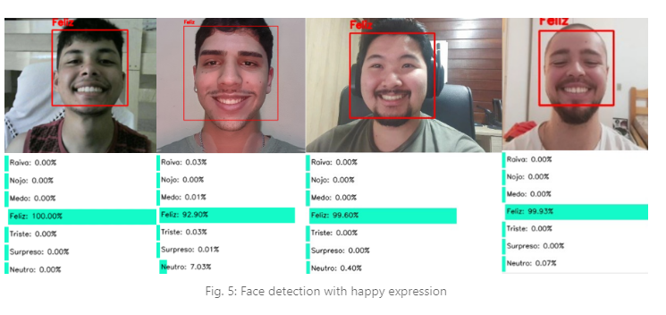
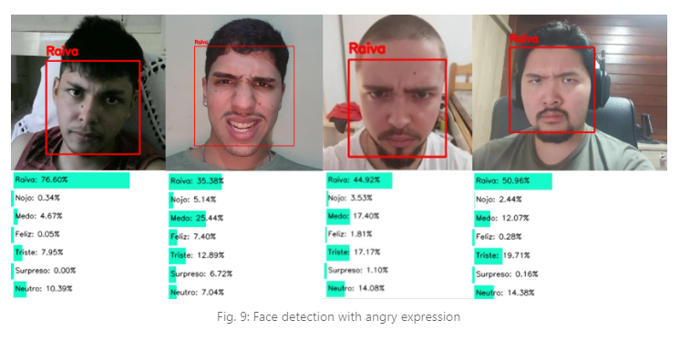

# Convolutional-Neural-Networks

<h1>
    </img>
     
    </img>
</h1>

## 📃 **About**

&nbsp;&nbsp;&nbsp;&nbsp;This work aims to contribute, through software, to the study of **human emotions** detected through facial expressions. 
&nbsp;&nbsp;&nbsp;&nbsp;It is expected that the application will act in a concise and relevant way in the behavioral analysis of an individual’s emotions. The results are extracted from a series of still images sent to the image processor script and the software developed during the project uses Artificial Neural Networks concepts and was built using the **Python** programming language.
 

---

## 📖 **Project article**

&nbsp;&nbsp;&nbsp;&nbsp;An article has been created to provide a more detailed demonstration of the project, showcasing data and practical experiences of its implementation.

[Convolutional Neural Networks article](https://www.linkedin.com/pulse/emotion-detection-using-neural-network-convolutional-lucas-de-abreu/) 

---

## 🛠 **Technologies used**

The project was developed using:

- Python

Using the libraries

- tensorflow

- cv2

- zipfile

- pandas 

- numpy 
 
 

---

## Developed by ⚙

| Author | Description |
| :---: | :--- |
| 
 | **Antonio Luis Canno de Araujo (https://github.com/tonicocanno)**  Developer/Student.  ||     
 | **Guilherme Koji Yamada (https://github.com/gkojiyamada)**  Developer/Student.  ||
 | **Lucas de Abreu Furtado Garcia (https://github.com/Jornay)**  Developer/Student.  ||
 | **Matheus Jacob Bendel (https://github.com/Matheus-jacobb)**  Developer/Student.  
